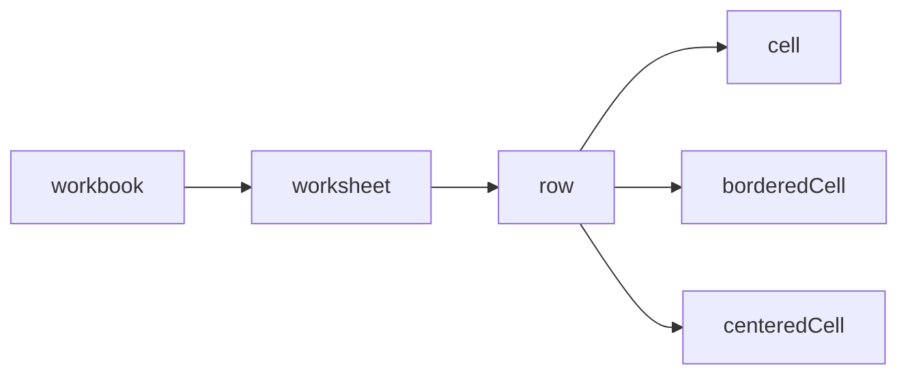

# @composize/excel

[](https://www.npmjs.com/package/@composize/excel)


[](https://www.codefactor.io/repository/github/composize/composize)

`@composize/excel` is a DSL for creating Excel files through a composable, declarative API.

It provides an intuitive interface to create complex Excel workbooks without directly dealing with the complexities of the underlying [ExcelJS](https://github.com/exceljs/exceljs) library.

## Key Features

- **Declarative Syntax**: Create Excel files using a simple, readable syntax that mirrors the structure of the resulting document.
- **Hierarchical Structure**: The DSL follows a hierarchical structure that reflects Excel's document model, making it easy to understand and maintain.
- **Composable Functions**: Each level of the hierarchy is represented by a function that accepts callback functions to define its children, allowing for a natural nesting structure.
- **Cell Merging**: Support for merging cells both horizontally and vertically.
- **Automatic Column Widths**: Automatically adjusts column widths based on the content of each cell.

## Installation

```bash
npm install @composize/excel
```

## Basic Example

Here's a simple example of how to create an Excel file using the DSL:

```ts
import { cell, row, workbook } from '@composize/excel';

workbook(() => {
  row(() => {
    cell('title1');
    cell('title2');
  });
  row(() => {
    cell('value1');
    cell('value2');
  });
});
```

## Core Concepts

The `@composize/excel` DSL follows a hierarchical structure that mirrors Excel's document model, with composable functions representing each level of the hierarchy.



The `@composize/excel` DSL uses a functional composition pattern where parent elements accept callback functions that define their children. This creates a natural nesting structure that makes the code's visual layout reflect the structure of the resulting Excel document.

## API Reference

The `@composize/excel` DSL includes the following key features:

| Function         | Description                                      | Parameters                             | Returns     |
| ---------------- | ------------------------------------------------ | -------------------------------------- | ----------- |
| `workbook()`     | Creates a new workbook                           | `composable: () => void`               | `Workbook`  |
| `worksheet()`    | Adds a new worksheet to the current workbook     | `name: string, composable: () => void` | `Worksheet` |
| `row()`          | Adds a new row to the current worksheet          | `composable: () => void`               | `Row`       |
| `cell()`         | Adds a cell to the current row                   | `value: string, options?: CellOptions` | `Cell`      |
| `borderedCell()` | Adds a cell with thin borders to the current row | `value: string, options?: CellOptions` | `Cell`      |
| `centeredCell()` | Adds a centered cell to the current row          | `value: string, options?: CellOptions` | `Cell`      |

### CellOptions

The `cell()` and `borderedCell()` functions accept an optional options parameter that allows for cell styling and merging:

| Option      | Type        | Description                               |
| ----------- | ----------- | ----------------------------------------- |
| `colSpan`   | `number`    | Number of columns to merge                |
| `rowSpan`   | `number`    | Number of rows to merge                   |
| `numFmt`    | `string`    | Number format string                      |
| `font`      | `Font`      | Font properties (size, name, color, etc.) |
| `alignment` | `Alignment` | Text alignment properties                 |
| `border`    | `Borders`   | Cell border properties                    |
| `fill`      | `Fill`      | Cell background fill properties           |

## Basic Usage

The simplest way to create an Excel file is by nesting function calls that mirror the structure of your desired spreadsheet:

```ts
import { workbook, row, cell } from '@composize/excel';

const book = workbook(() => {
  row(() => {
    cell('Title 1');
    cell('Title 2');
  });
  row(() => {
    cell('Value 1');
    cell('Value 2');
  });
});

// Save the workbook to a file
book.xlsx.writeFile('./example.xlsx');
```
This creates a simple 2x2 table with headers and values.

## Worksheets

By default, if no worksheet is explicitly created, the DSL automatically creates a worksheet named "Sheet1":

```ts
const book = workbook(() => {
  row(() => {
    cell('Data without explicit worksheet');
  });
});
```

You can explicitly create named worksheets using the `worksheet()` function:

```ts
const book = workbook(() => {
  worksheet('First Sheet', () => {
    row(() => {
      cell('Data in first sheet');
    });
  });

  worksheet('Second Sheet', () => {
    row(() => {
      cell('Data in second sheet');
    });
  });
});
```

## Cell Merging

The Excel DSL supports merging cells both horizontally (using `colSpan`) and vertically (using `rowSpan`):

### Horizontal Merging (Column Span)

To merge cells horizontally, use the `colSpan` option:

```ts
workbook(() => {
  row(() => {
    cell('Wide Header', { colSpan: 3 });
  });
  row(() => {
    cell('Data 1');
    cell('Data 2');
    cell('Data 3');
  });
});
```

This creates a header cell that spans across three columns.

### Vertical Merging (Row Span)

To merge cells vertically, use the `rowSpan` option:

```ts
workbook(() => {
  row(() => {
    cell('Tall Cell', { rowSpan: 2 });
    cell('Top Cell');
  });
  row(() => {
    // No need to set the first cell, it's already covered by the merged cell
    cell('Bottom Cell');
  });
});
```

This creates a cell that spans two rows in the first column.

### Combined Merging

You can combine both horizontal and vertical merging:

```ts
workbook(() => {
  row(() => {
    cell('Large Cell', { rowSpan: 2, colSpan: 2 });
    cell('Top Right');
  });
  row(() => {
    cell('Bottom Right');
  });
});
```

This creates a cell that spans two rows and two columns in the top-left corner.

## Cell Styling

### Basic Styling

The `cell()` function accepts styling options from ExcelJS's Cell object:

```ts
cell('Styled Text', {
  font: { bold: true, size: 14 },
  alignment: { vertical: 'middle', horizontal: 'center' },
  fill: { type: 'pattern', pattern: 'solid', fgColor: { argb: 'FFFF0000' } }
});
```

### Bordered Cells

For convenience, the DSL provides a `borderedCell()` function that applies thin borders to all sides of a cell:

```ts
row(() => {
  borderedCell('Bordered Content');
  borderedCell('Custom Format', { numFmt: '0.00' });
});
```

The `borderedCell()` function accepts the same options as `cell()`, but automatically adds thin borders.

### Centered Cells

For convenience, DSL also provides a `centeredCell()` function, which builds on top of `borderedCell()` and applies centered alignment to the cell.

```ts
row(() => {
  centeredCell('Centered Text');
  centeredCell('Custom Format', { numFmt: '0.00' });
});
```

The `centeredCell()` function accepts the same options as `borderedCell()`, but automatically adds centered alignment.

## Auto-fitting Columns

The Excel DSL automatically adjusts column widths based on the content of each cell. For merged cells, auto-fitting enables text wrapping instead of increasing width.

## Complete Example

Here's a more complex example that demonstrates many features of the Excel DSL:

```ts
const book = workbook(() => {
  worksheet('Report', () => {
    // Header row with merged title
    row(() => {
      centeredCell('Quarterly Report', {
        colSpan: 4,
        font: { bold: true, size: 16 }
      });
    });

    // Empty row for spacing
    row(() => {});

    // Column headers
    row(() => {
      const headers = ['Category', 'Q1', 'Q2', 'Q3'];
      for (const header of headers) {
        borderedCell(header, { font: { bold: true } });
      }
    });

    // Data rows
    row(() => {
      borderedCell('Revenue');
      borderedCell(10000, { numFmt: '$#,##0' });
      borderedCell(12000, { numFmt: '$#,##0' });
      borderedCell(15000, { numFmt: '$#,##0' });
    });

    row(() => {
      borderedCell('Expenses');
      borderedCell(8000, { numFmt: '$#,##0' });
      borderedCell(8500, { numFmt: '$#,##0' });
      borderedCell(9000, { numFmt: '$#,##0' });
    });

    row(() => {
      borderedCell('Profit', { font: { bold: true } });
      borderedCell(2000, { numFmt: '$#,##0', font: { bold: true } });
      borderedCell(3500, { numFmt: '$#,##0', font: { bold: true } });
      borderedCell(6000, { numFmt: '$#,##0', font: { bold: true } });
    });
  });
});

book.xlsx.writeFile('quarterly_report.xlsx');
```

## Changelog

[Learn about the latest improvements.](https://github.com/composize/composize/blob/main/packages/excel/CHANGELOG.md)

## Support

Do you love ✨ composize ✨ ? Star for [this](https://github.com/composize/composize) project!

##  Special thanks

Thanks to [JetBrains](https://www.jetbrains.com/?from=composize) for supporting us free open source licenses.


## License

[MIT](https://github.com/composize/composize/blob/main/LICENSE)
