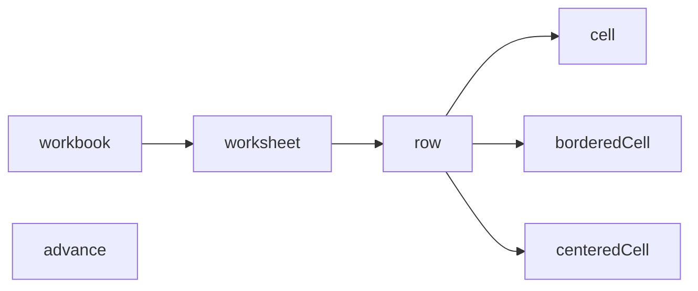

# @composize/excel

[](https://www.npmjs.com/package/@composize/excel)


[](https://codecov.io/gh/composize/composize)
[](https://www.codefactor.io/repository/github/composize/composize)

`@composize/excel` is a DSL for creating Excel files through a composable, declarative API.

It provides an intuitive interface to create complex Excel workbooks without directly dealing with the complexities of the underlying [ExcelJS](https://github.com/exceljs/exceljs) library.

## Key Features

- **Declarative Syntax**: Create Excel files using a simple, readable syntax that mirrors the structure of the resulting document.
- **Hierarchical Structure**: The DSL follows a hierarchical structure that reflects Excel's document model, making it easy to understand and maintain.
- **Composable Functions**: Each level of the hierarchy is represented by a function that accepts callback functions to define its children, allowing for a natural nesting structure.
- **Cell Merging**: Support for merging cells both horizontally and vertically.
- **Automatic Column Widths**: Automatically adjusts column widths based on the content of each cell.

## Installation

```bash
npm install @composize/excel
```

## Basic Example

Here's a simple example of how to create an Excel file using the DSL:

```ts
import { cell, row, workbook } from '@composize/excel';

workbook(() => {
  row(() => {
    cell('title1');
    cell('title2');
  });
  row(() => {
    cell('value1');
    cell('value2');
  });
});
```

## Core Concepts

The `@composize/excel` DSL follows a hierarchical structure that mirrors Excel's document model, with composable functions representing each level of the hierarchy.



The `@composize/excel` DSL uses a functional composition pattern where parent elements accept callback functions that define their children. This creates a natural nesting structure that makes the code's visual layout reflect the structure of the resulting Excel document.

## API Reference

The `@composize/excel` DSL includes the following key features:

| Function         | Description                                      | Parameters                                          | Returns       |
| ---------------- | ------------------------------------------------ | --------------------------------------------------- | ------------- |
| `workbook()`     | Creates a new workbook                           | `composable: (it: Workbook) => void`                | `Workbook`    |
| `worksheet()`    | Adds a new worksheet to the current workbook     | `name: string, composable: (it: Worksheet) => void` | `Worksheet`   |
| `row()`          | Adds a new row to the current worksheet          | `composable: (it: Row) => void`                     | `Row`         |
| `cell()`         | Adds a cell to the current row                   | `value: string, options?: CellOptions`              | `Cell`        |
| `borderedCell()` | Adds a cell with thin borders to the current row | `value: string, options?: CellOptions`              | `Cell`        |
| `centeredCell()` | Adds a centered cell to the current row          | `value: string, options?: CellOptions`              | `Cell`        |
| `fillSolid()`    | Creates a solid fill style for cells             | `fgColor: string, bgColor?: string`                 | `FillPattern` |
| `advance()`      | Advance to row or column                         | `delta?: number`                                    | `void`        |

### CellOptions

The `cell()` functions accept an optional options parameter that allows for cell styling and merging:

| Option       | Type         | Description                               |
| ------------ | ------------ | ----------------------------------------- |
| `colSpan`    | `number`     | Number of columns to merge                |
| `rowSpan`    | `number`     | Number of rows to merge                   |
| `numFmt`     | `string`     | Number format string                      |
| `font`       | `Font`       | Font properties (size, name, color, etc.) |
| `alignment`  | `Alignment`  | Text alignment properties                 |
| `border`     | `Borders`    | Cell border properties                    |
| `fill`       | `Fill`       | Cell background fill properties           |
| `protection` | `Protection` | Cell protection properties                |

## Basic Usage

The simplest way to create an Excel file is by nesting function calls that mirror the structure of your desired spreadsheet:

```ts
import { workbook, row, cell } from '@composize/excel';

const book = workbook(() => {
  row(() => {
    cell('Title 1');
    cell('Title 2');
  });
  row(() => {
    cell('Value 1');
    cell('Value 2');
  });
});

// Save the workbook to a file
book.xlsx.writeFile('./example.xlsx');
```
This creates a simple 2x2 table with headers and values.

## Worksheets

By default, if no worksheet is explicitly created, the DSL automatically creates a worksheet named "Sheet1":

```ts
const book = workbook(() => {
  row(() => {
    cell('Data without explicit worksheet');
  });
});
```

You can explicitly create named worksheets using the `worksheet()` function:

```ts
const book = workbook(() => {
  worksheet('First Sheet', () => {
    row(() => {
      cell('Data in first sheet');
    });
  });

  worksheet('Second Sheet', () => {
    row(() => {
      cell('Data in second sheet');
    });
  });
});
```

## Cell Merging

The `@composize/excel` DSL supports merging cells both horizontally (using `colSpan`) and vertically (using `rowSpan`):

### Horizontal Merging (Column Span)

To merge cells horizontally, use the `colSpan` option:

```ts
workbook(() => {
  row(() => {
    cell('Wide Header', { colSpan: 3 });
  });
  row(() => {
    cell('Data 1');
    cell('Data 2');
    cell('Data 3');
  });
});
```

This creates a header cell that spans across three columns:

```
+--------+--------+--------+
|       Wide Header        |
+--------+--------+--------+
| Data 1 | Data 2 | Data 3 |
+--------+--------+--------+
```

### Vertical Merging (Row Span)

To merge cells vertically, use the `rowSpan` option:

```ts
workbook(() => {
  row(() => {
    cell('Tall Cell', { rowSpan: 2 });
    cell('Top Cell');
  });
  row(() => {
    // No need to set the first cell, it's already covered by the merged cell
    cell('Bottom Cell');
  });
});
```

This creates a cell that spans two rows in the first column:

```
+--------+--------+-------------+
|                 | Top Cell    |
|    Tall Cell    +-------------+
|                 | Bottom Cell |
+--------+--------+-------------+
```

### Combined Merging

You can combine both horizontal and vertical merging:

```ts
workbook(() => {
  row(() => {
    cell('Header 1', { rowSpan: 2, colSpan: 2 });
    cell('Header 2');
  });
  row(() => {
    cell('Header 3');
  });
  row(() => {
    cell('Data 1');
    cell('Data 2', { rowSpan: 2, colSpan: 2 });
  })
  row(() => {
    cell('Data 3');
  })
});
```

This creates a complex merged structure:

```
+--------+--------+----------+
|                 | Header 2 |
|     Header 1    +----------+
|                 | Header 3 |
+--------+--------+----------+
| Data 1 |                   |
+--------+      Data 2       +
| Data 3 |                   |
+--------+-------------------+
```

## Advanced

The `advance()` function allows you to move the current position by a specified number of rows or columns. By default, it advances by one row or column:

```ts
row(() => {
  cell('Cell 1');
  advance();   // → Move back one column
  cell('Cell 3');
});
advance();     // ↓ Move down two rows
row(() => {
  cell('Cell 1');
  advance(2);  // → Move back one column
  cell('Cell 4');
  advance(-3); // ← Move forward three column
  cell('Cell 2');
});
```

This creates the following layout:

```
+--------+--------+--------+--------+
| Cell 1 |        | Cell 3 |        |
+--------+--------+--------+--------+
|        |        |        |        |
+--------+--------+--------+--------+
| Cell 1 | Cell 2 |        | Cell 4 |
+--------+--------+--------+--------+
```

## Cell Styling

### Basic Styling

The `cell()` function accepts styling options from ExcelJS's Cell object:

```ts
cell('Styled Text', {
  font: { bold: true, size: 14 },
  alignment: { vertical: 'middle', horizontal: 'center' },
});
```

### Fill

You can apply background fills to cells using the `fill` option. For example, to apply a solid fill:

```ts
cell('Solid Fill', {
  fill: { type: 'pattern', pattern: 'solid', fgColor: { argb: Color.Red } }
});
```

You can create fill patterns using the `fillSolid()` helper function:

```ts
cell('Solid Fill', {
  fill: fillSolid(Color.Red)
});
```

### Bordered

For convenience, the DSL provides a `borderedCell()` function that applies thin borders to all sides of a cell:

```ts
row(() => {
  borderedCell('Bordered Content');
  borderedCell('Custom Format', { numFmt: '0.00' });
});
```

The `borderedCell()` function accepts the same options as `cell()`, but automatically adds thin borders.

### Centered

For convenience, the DSL also provides a `centeredCell()` function, which builds on top of `borderedCell()` and applies centered alignment to the cell.

```ts
row(() => {
  centeredCell('Centered Text');
  centeredCell('Custom Format', { numFmt: '0.00' });
});
```

The `centeredCell()` function accepts the same options as `borderedCell()`, but automatically adds centered alignment.

### Protected

You can protect cells from editing using the `protection` option:

```ts
cell('Protected Cell', {
  protection: { locked: true }
});
```

## Automatic Column Widths

The `@composize/excel` DSL automatically adjusts column widths based on the content of each cell. For merged cells, auto-fitting enables text wrapping instead of increasing width.

## Constants

### Color

Predefined ARGB color values for Excel styling:

| Constant         | Value      | Color     |
| ---------------- | ---------- | --------- |
| Color.DarkRed    | `ffc00000` | `#c00000` |
| Color.Red        | `ffff0000` | `#ff0000` |
| Color.Orange     | `ffffc000` | `#ffc000` |
| Color.Yellow     | `ffffff00` | `#ffff00` |
| Color.LightGreen | `ff92d050` | `#92d050` |
| Color.Green      | `ff00b050` | `#00b050` |
| Color.LightBlue  | `ff00b0f0` | `#00b0f0` |
| Color.Blue       | `ff0070c0` | `#0070c0` |
| Color.DarkBlue   | `ff002060` | `#002060` |
| Color.Purple     | `ff7030a0` | `#7030a0` |

### FontSize

Standardized font sizes organized by usage context:

<table>
  <tr>
    <th>Category</th>
    <th>Constant</th>
    <th>Value</th>
  </tr>
  <tr>
    <td>Caption</td>
    <td>FontSize.Caption</td>
    <td align="right">8</td>
  </tr>
  <tr>
    <td>Footnote</td>
    <td>FontSize.Footnote</td>
    <td align="right">9</td>
  </tr>
  <tr>
    <td rowspan="3">Body Text</td>
    <td>FontSize.BodySmall</td>
    <td align="right">10</td>
  </tr>
  <tr>
    <td>FontSize.Body</td>
    <td align="right">11</td>
  </tr>
  <tr>
    <td>FontSize.BodyLarge</td>
    <td align="right">12</td>
  </tr>
  <tr>
    <td>Subheading</td>
    <td>FontSize.Subheading</td>
    <td align="right">14</td>
  </tr>
  <tr>
    <td rowspan="3">Titles</td>
    <td>FontSize.TitleSmall</td>
    <td align="right">16</td>
  </tr>
  <tr>
    <td>FontSize.Title</td>
    <td align="right">18</td>
  </tr>
  <tr>
    <td>FontSize.TitleLarge</td>
    <td align="right">20</td>
  </tr>
  <tr>
    <td rowspan="3">Headings</td>
    <td>FontSize.HeadingSmall</td>
    <td align="right">22</td>
  </tr>
  <tr>
    <td>FontSize.Heading</td>
    <td align="right">24</td>
  </tr>
  <tr>
    <td>FontSize.HeadingLarge</td>
    <td align="right">26</td>
  </tr>
  <tr>
    <td rowspan="4">Display</td>
    <td>FontSize.DisplaySmall</td>
    <td align="right">28</td>
  </tr>
  <tr>
    <td>FontSize.Display</td>
    <td align="right">36</td>
  </tr>
  <tr>
    <td>FontSize.DisplayLarge</td>
    <td align="right">48</td>
  </tr>
  <tr>
    <td>FontSize.DisplayXL</td>
    <td align="right">72</td>
  </tr>
</table>

## Complete Example

Here's a more complex example that demonstrates many features of the `@composize/excel` DSL:

```ts
const headers = ['Category', 'Q1', 'Q2', 'Q3'];
const data = [
  { category: 'Revenue', q1: 10000, q2: 12000, q3: 15000 },
  { category: 'Expenses', q1: 8000, q2: 8500, q3: 9000 },
  { category: 'Profit', q1: 2000, q2: 3500, q3: 6000 }
];
const book = workbook(() => {
  worksheet('Report', () => {
    // Header row with merged title
    row(() => {
      centeredCell('Quarterly Report', {
        colSpan: headers.length,
        font: { bold: true, size: FontSize.TitleSmall }
      });
    });
    // Column headers
    row(() => {
      for (const header of headers) {
        borderedCell(header, { font: { bold: true } });
      }
    });
    // Data rows
    for (const item of data) {
      row(() => {
        borderedCell(item.category);
        borderedCell(item.q1, { numFmt: '$#,##0' });
        borderedCell(item.q2, { numFmt: '$#,##0' });
        borderedCell(item.q3, { numFmt: '$#,##0' });
      });
    }
  });
});

book.xlsx.writeFile('quarterly_report.xlsx');
```

## Changelog

[Learn about the latest improvements.](https://github.com/composize/composize/blob/main/packages/excel/CHANGELOG.md)

## Support

Do you love ✨ composize ✨ ? Star for [this](https://github.com/composize/composize) project!

##  Special thanks

Thanks to [JetBrains](https://www.jetbrains.com/?from=composize) for supporting us free open source licenses.


## License

[MIT](https://github.com/composize/composize/blob/main/LICENSE)
